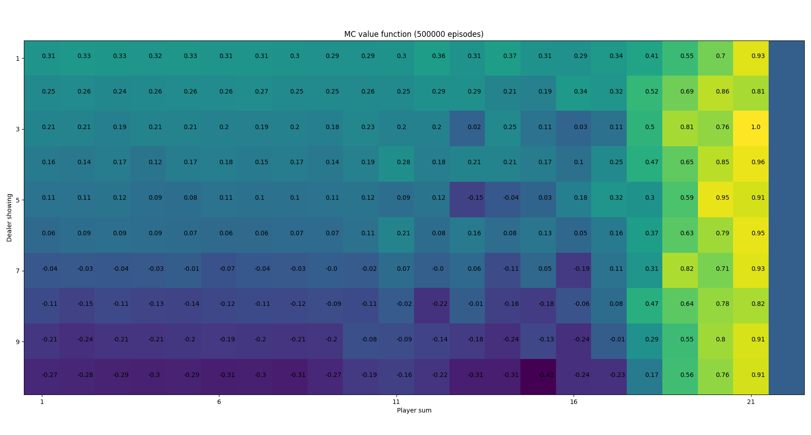
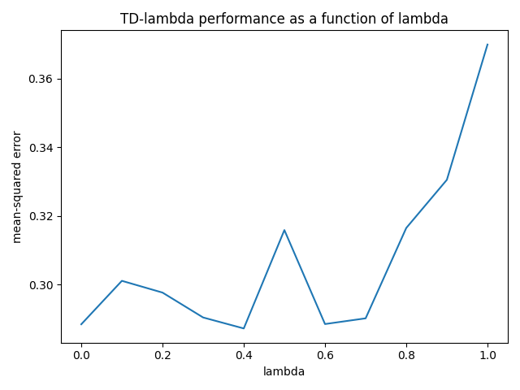
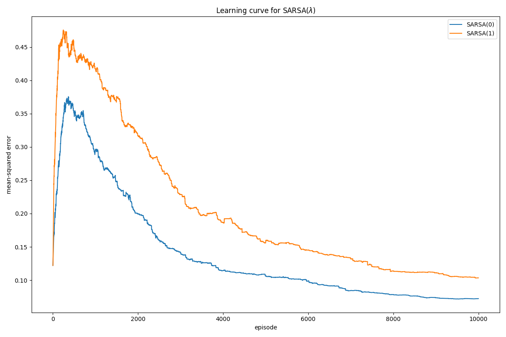

# Easy 21 - DeepMind RL course

Implementation of the Easy21 assignment (for more info, see `Easy21.pdf`). We use various techniques from model-free reinforcement learning to find an optimal policy for the game.

## Dicussion

> _What are the pros and cons of bootstrapping in Easy21?_

Bootstrapping using Temporal Difference learning (TD) means that we update a guess towards a guess, i.e. update a current approximation of the value function towards the current reward and the approximation of the value of the next state. This often works well in environments that are inherently Markov. Since the value of states in Easy21 is only dependent on the current state information (what the dealer showing and the sum of the player cards), Easy21 is inherently Markov and thus well suited for TD-based prediction.

> _Would you expect bootstrapping to help more in blackjack or Easy21?  Why?_

> _What are the pros and cons of function approximation in Easy21?_

> _How would you modify the function approximator suggested in this section to get better results in Easy21?_

## Monte-Carlo Control

Action-value function using MC evaluation and decaying epsilon-greedy policy improvement (asymptotically converges to the optimal action-value function):

## SARSA(λ)

