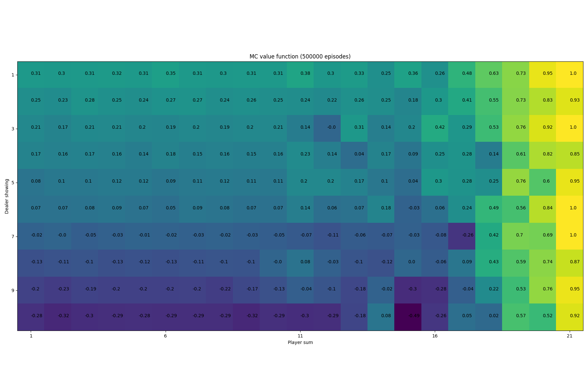
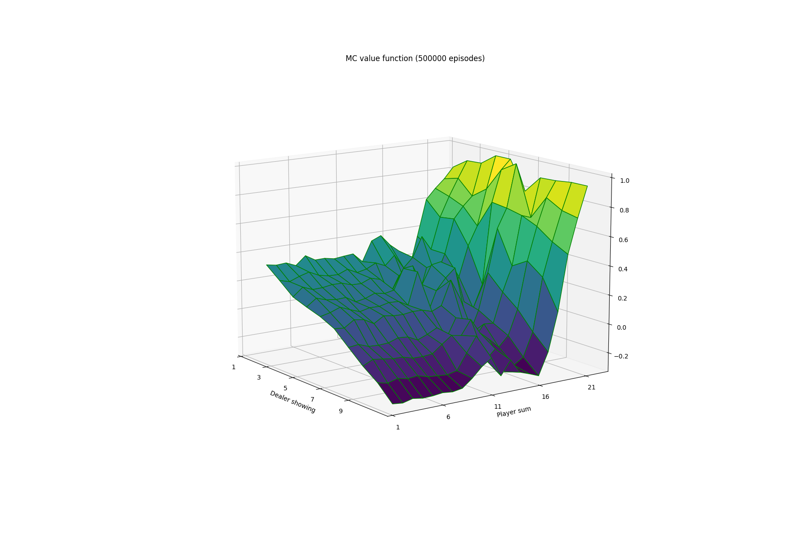
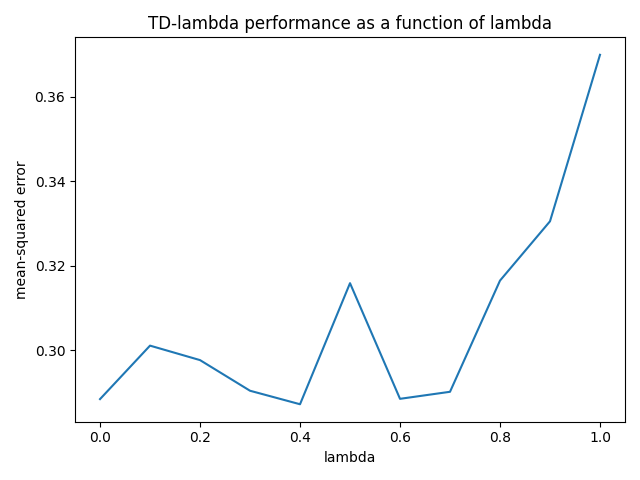
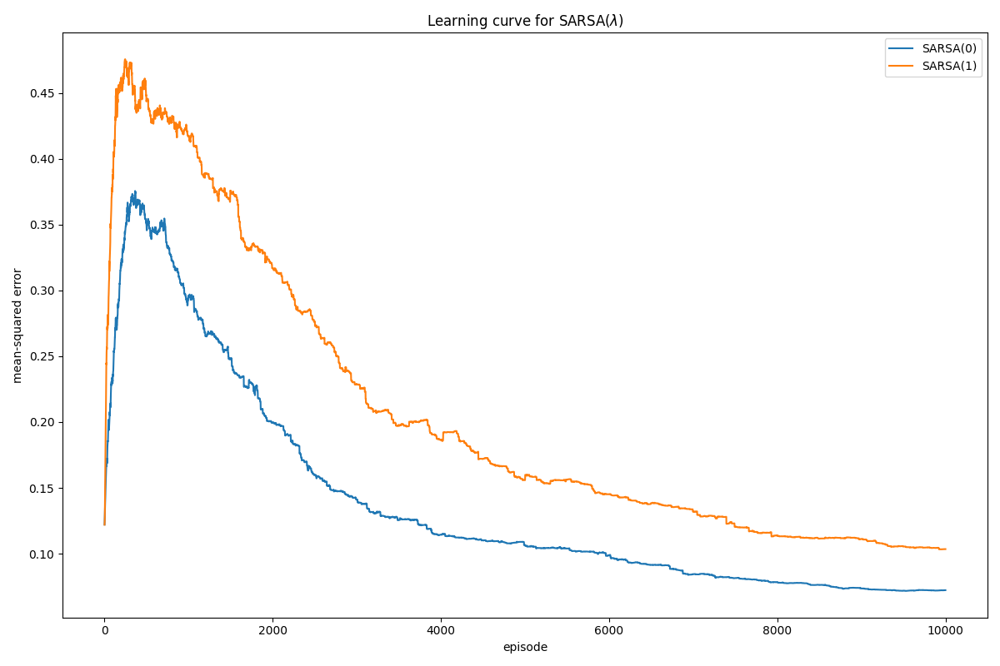
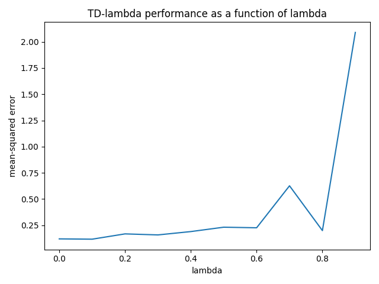
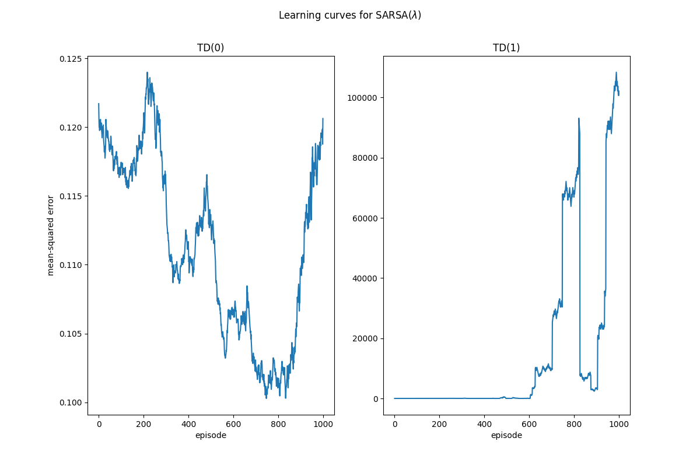
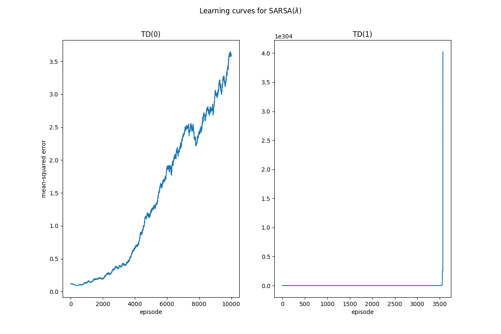

# Easy 21 - DeepMind RL course

Implementation of the Easy21 assignment (for more info, see `Easy21.pdf`). Various techniques from model-free reinforcement learning are used to find an optimal policy for the Easy21 game.

## Dicussion

> _What are the pros and cons of bootstrapping in Easy21?_

Bootstrapping using Temporal Difference learning (TD) means that we update a guess towards a guess, i.e. update a current approximation of the value function towards the current reward and the approximation of the value of the next state. This often works well in environments that are inherently Markov. Since the value of states in Easy21 is only dependent on the current state information (what the dealer showing and the sum of the player cards), Easy21 is inherently Markov and thus well suited for TD-based prediction.

> _Would you expect bootstrapping to help more in blackjack or Easy21?  Why?_

> _What are the pros and cons of function approximation in Easy21?_

Pros:

1. Unlike table lookups, function approximation allows us to consider the relationship between state-action pairs by encoding their similarity. In this case, we encode this similarity manually using features based on state-action cuboids. An alternative option is to use learned features, e.g. using a neural network that directly takes the raw state-action pair as input. Whereas table lookup stores an independent value for each state-action pair, function approximation allows us to update the value function for several similar state-action pairs based on the value of a single state-action pair.

Cons:

> _How would you modify the function approximator suggested in this section to get better results in Easy21?_

## Monte-Carlo Control

Action-value function using MC evaluation and decaying epsilon-greedy policy improvement (asymptotically converges to the optimal action-value function):

## SARSA(λ)

### Interpretation

SARSA(0) is biased in the sense that it only considers the current reward and the value estimate of the next state. SARSA(1), on the other hand, is similar to Monte-Carlo in that it updates towards the undiscounted return for the rest of the episode. This makes it less biased, but the value function approximation has more variance. However, SARSA(1) is different from MC in that it updates _online_, i.e. every time step, as opposed to the MC control which updates _offline_, i.e. once at the end of an episode.

Because SARSA(1) implies more variance, it makes sense to me that it takes longer for it to converge to a low error. For SARSA(0), I would expect it to learn faster, but perhaps not converge to the optimal value function. Looking at the plot above, after 10,000 episodes, SARSA(0) outperforms SARSA(1). It may be that because the Easy21 game is inherently Markov (i.e. the current state is sufficient to predict the future), looking at only the immediate reward and state value is sufficient to effectively learn the value function (which is done in SARSA(0)).

## Linear Function Approximation 

One thing that is notable about using the linear function approximator is that the number of episodes suddenly becomes an important hyperparameter. For example, both TD(0) and TD(1) diverge after running for 10,000 episodes:

